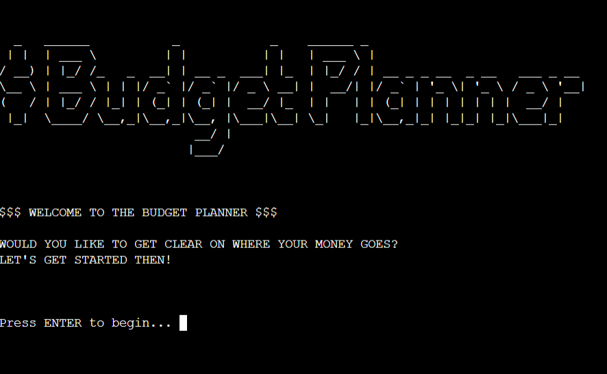

# Budget Planner $$$

Visit the deployed site here: [Budget Planner](https://budget-planner-ef48562f3908.herokuapp.com/)

Acess data from the googlesheets (view only) [Projects Google Sheets](https://docs.google.com/spreadsheets/d/1tFWIhaIpQUKqYTmgPDXH9BrgyeMR3SbNc6ddLSzBp84/edit?usp=sharing) 

This application is designed to track and manage my budget efficiently. It allows me to input income and expenses, categorize them, and generate monthly summaries using Google Sheets for data storage. I created this tool to have a better grasp of my personal finances and make informed financial decisions.

# List of content:
* [**User Experience/User Interface (UX/UI)**](#user-experienceuser-interface-uxui)
  * [User Stories](#user-stories)
  * [User Goals](#user-goals)
    * [First Time Visitor Goals](#first-time-visitor-goals)
    * [Returning Visitor Goals](#returning-visitor-goals)
* [**Project Creation**](#project-creation)
  * [Design](#design)
  * [Planning](#planning)
    * [Flowchart](#flowchart)
    * [Google API Setup](#google-api-setup)
    * [Google Sheets](#google-sheets)
  * [Python Logic](#python-logic)
    * [Key Functions](#key-functions)
    * [Helper Functions](#helper-functions)
* [**Features**](#features)
   * [How to Use Budget Planner](#how-to-use-budget-planner)
      * [Step-by-Step Guide](#step-by-step-guide)
      * [Starting the Application](#starting-the-application)
      * [Main Menu](#main-menu)
      * [Generating a New Budget](#generating-a-new-budget)
      * [Entering Income](#entering-income)
      * [Entering Expenses](#entering-expenses)
      * [Viewing the Budget Summary](#viewing-the-budget-summary)
      * [Add Data to the Budget](#add-data-to-the-budget)
      * [Deleting an Entry](#deleting-an-entry)
      * [Exiting the Program](#exiting-the-program)
* [**Future Enhancements**](#future-enhancements)
* [**Languages and Technologies Used**](#languages-and-technologies-used)
* [**Libraries & Packages**](#libraries--packages)
* [**Testing**](#testing)
  * [Manual Testing](#manual-testing)
  * [Code Validation](#code-validation)
  * [Known Bugs / Fixed Bugs](#known-bugs--fixed-bugs)
* [**Setting up & Deployment**](#setting-up--deployment)
  * [Creating a New Repository](#creating-a-new-repository)
  * [Forking the GitHub Repository](#forking-the-github-repository)
  * [Activating the Google Drive & Sheets API](#activating-the-google-drive--sheets-api)
  * [Setting up the Gitpod Workspace for the APIs](#setting-up-the-gitpod-workspace-for-the-apis)
  * [Initial Code for Connecting to Our API with Python](#initial-code-for-connecting-to-our-api-with-python)
  * [Deploying to Heroku](#deploying-to-heroku)
* [**Credits**](#credits)
  * [Content](#content)
  * [Learning and Support Resources](#learning-and-support-resources)
  * [Personal Comments](#personal-comments)
* [**Acknowledgements**](#acknowledgements)
* [**Contact Information**](#contact-information)

## User Experience/User Interface (UX/UI) 

## User Stories

**As the primary user, I:**

- Need clear instructions on how to navigate through the application.
  - The application displays clear prompts for each step, guiding me through entering income, expenses, and generating summaries.
  - Error messages are provided for invalid inputs, ensuring I understand how to correct mistakes.
  
- Want to easily input and track my monthly income and expenses.
  - I can select or add income categories such as Salary and Sales, and input the respective amounts.
  - I can select or add expense categories such as House Bills, Shopping, and Entertainment, and input the respective amounts.

- Want to generate and view monthly budget summaries.
  - The `budget_summary` function generates a clear summary showing total income, total expenses, and the balance for a selected month.

- Want to know if there are any new updates or features.
  - Future updates and features will be documented and accessible via the application's main menu or a dedicated section.

## User Goals

### First Time Visitor Goals

1. Understand the main purpose of the site and learn about the Budget Planner.
   - The welcome message and introductory text clearly explain the application's purpose and how it can help manage personal finances.

2. Navigate the site easily to start using the application.
   - The main menu provides options to display the budget summary, generate a new budget, edit an existing budget, delete an entry, or exit the application.

3. Experience a user-friendly interface for entering and managing budget data.
   - Clear and concise prompts guide the user through each process, making it easy to add income, record expenses, and view summaries.

### Returning Visitor Goals

1. Access new or updated budget data.
   - The `catch_month` function allows me to select a month and view or update the budget data for that period.

2. Easily input new income or expenses.
   - The `income_categories` and `outgoings_categories` functions allow me to add new income or expenses quickly.

3. Easily delete previous entries if needed.
   - The `delete_entry` function lets me remove specific entries from the budget tracker.

4. Check the summary for previous budgets.
   - The `budget_summary` function generates summaries for previous months, allowing me to review my financial history.

 

# Project Creation

## Design   

The entire program is displayed in a Command Line Interface (CLI). The application is designed to be user-friendly with clear prompts and validations to guide users through various tasks such as adding income, recording expenses, and generating summaries.

## Planning 

- **Flowchart :** A detailed flowchart was created to outline the user journey and application logic.

- **Google API SetUp :**   
Prior to starting any program function code, the relevant Credentials and API setup took place. Security was a crucial factor in connecting to a Google Account to access the Google Sheets worksheet. Guidance for setting up these authorizations and credentials was provided through the Code Institute's Full Stack Software Development course.

- **Google Sheets :**
Used to store my data, simulating a database. All data entry and manipulation occur within the terminal, and the user interacts with a clear and straightforward CLI.

- 

## Python Logic  
The project utilizes Python to create an application that accesses, displays, and edits data from Google Sheets. The core functionality includes menus created using if/elif statements and user input validation using while loops and try/except statements.

### Key Functions

 [Function List](readme_documents/screenshots/functions_list.png)
- **main:** The main function that displays the main menu and handles user input to navigate through the core functionalities.
- **catch_month:** Prompts the user to select a month to interact with, ensuring valid input.
- **generate_month:** Checks if a month exists in the tracker and generates a new month if it doesn't.
- **choose_category:** Lets the user choose whether to enter income or expenses for a selected month.
- **income_categories:** Allows the user to add income from predefined categories or create new ones.
- **add_income:** Appends income data to the existing month.
- **outgoings_categories:** Allows the user to add expenses from predefined categories or create new ones.
- **add_outgoings:** Appends outgoing data to the existing month.
- **budget_decision:** Prompts the user for the next step after a function is completed.
- **budget_summary:** Generates and displays a summary of the selected month's budget.
- **delete_entry:** Allows the user to delete specific budget entries.

### Helper Functions
- **welcome_page:** Displays a welcome message to the user.
- **clear_screen:** Clears the terminal for a cleaner display of the next menu or prompt.
- **display_data:** Displays detailed budget data to the user.
- **exit_program:** Exits the program with a clear message.

 

# Features

## How to Use Budget Planner

### Step-by-Step Guide

1. **Starting the Application**

- *[Show Welcome Message](readme_documents/screenshots/welcome_screen.png)*

   - When you run the application, you will be greeted with a welcome message.
   - Press "ENTER" to begin.

2. **Main Menu**
- *[Show Main Menu](readme_documents/screenshots/main_menu.png)*

   - You will be presented with the following options:
       1. Display Budget Summary
       2. Generate Budget
       3. Add data to the existing month
       4. Delete Entry
       5. EXIT
   
   - Enter the number corresponding to the action you want to take.

3. **Generating a New Budget**
- *[Show Generate Budget](readme_documents/screenshots/generate_budget.png)*

   - If you choose to generate a new budget (option 2), you will be prompted to enter the first three letters of the month you are interested in (e.g., "Jan" for January).
   - If the month does not exist in the tracker, you will have the option to create it.

4. **Entering Income**
- *[Display Add Income](readme_documents/screenshots/add_income.png)*
- *[Display Additional Income](readme_documents/screenshots/additional_income.png)*

   - After selecting or creating a month, you can choose to add income.
   - Select the income category (e.g., Salary, Sales) or create a new category.
   - Enter the income amount when prompted.

5. **Entering Expenses**
- *[Add Expenses](readme_documents/screenshots/add_outgoings.png)*
   - You can also choose to add outgoings for the selected month.
   - Select the outgoing category (e.g., House Bills, Shopping) or create a new category.
   - Enter the expense amount when prompted.

6. **Viewing the Budget Summary**
 - *[Budget Breakdown](readme_documents/screenshots/budget_breakdown.png)*
   - To view the budget summary, select option 1 from the main menu.
   - Choose the month you want to view.
   - The summary will display the total income, total expenses, and balance for the selected month.
   - You will then have a chnace to see detailed breakdown of the budget.

7. **Add data to the Budget**
- *[Add data](readme_documents/screenshots/choice_income_outcome.png)*
   - To add datda to an existing budget, select option 3 from the main menu.
   - Choose the month you want to work with.
   - You can then add income and expenses for that month.

8. **Deleting an Entry**
- *[Delete Entry](readme_documents/screenshots/delete_entry.png)*
   - To delete an entry, select option 4 from the main menu.
   - Choose the month and the specific entry you want to delete.

   - Confirm the deletion.

9. **Exiting the Program**
- *[Exit Program](readme_documents/screenshots/exit_program.png)*
   - To exit the program, select option 5 from the main menu.
   - A goodbye message will be displayed, and the program will close.

-----  

 

## Future Enhancements

- **Year Tracking:** Add functionality to track budget data by year.
- **Multiple Users:** Allow multiple users to manage their budgets separately.
- **Improved Aesthetics:** Enhance the CLI interface for a more visually appealing experience.
- **Additional Libraries:** Integrate with other libraries for faster response times and improved functionality.

-----  

 

# Languages and Technologies Used 
   - **Python:** Core programming language used to develop the application.
   - [Google Sheets](https://docs.google.com/spreadsheets/) Used for data storage and manipulation.
   - [Google Cloud Platform](https://cloud.google.com/): Provides the APIs for connecting to Google Sheets. 
   - [GitHub](https://github.com/) - used for hosting the program's source code.
   - [Gitpod](https://www.gitpod.io/) - used as a workspace for developing the code and testing the program.
   - **Git:** Used for version control.
   - [Heroku](https://heroku.com/apps) - used for deploying the project.
   - [PEP8 Validator](https://pep8ci.herokuapp.com/) - used for validating the Python code.
   - [Canva](https://canva.com/) - used to create the flowchart needed during project planning.
   - [Tiny PNG](https://tinypng.com/) - used to compress images for readme.
-----  

 

# Libraries & Packages 
- **gspread:** Used to add, remove and manipulate data in the connected Google Sheets worksheets.
- **google.oauth.service_account:** Used for the authentication needed to access the Google APIs for connecting the Service Account with the Credentials function.
- **os:** Used to add the clear_screen function to assist in creating a neater flow from Menu options by clearing the screen for the user's choice from the Menu to be displayed. 

-----  
 

# Testing  
Extensive testing was conducted to ensure the application's functionality. This includes manual testing of all features, validating user inputs, and ensuring seamless interaction with Google Sheets 
- *[Testing Results 1](readme_documents/screenshots/error_message.png)*
- *[Testing Results 2](readme_documents/screenshots/invalid_input.png)*
- *[Testing Results 3](readme_documents/screenshots/existing_month.png)*

## Manual Testing
Manual testing was conistently implemented during the processs. Few different versions were used throughout the project untill an ultimate was found.

- *[Manual Testing 1](readme_documents/screenshots/manual_testing_1.png)*
- *[ManualTesting 2 ](readme_documents/screenshots/manual_testing_2.png)*

### Code Validation
- The code was validated using PEP8 standards to ensure readability and maintainability.

### Known Bugs / fixed bugs 
- #### No known bugs recorded at the end of the project.
No known bugs recorded at the end of the project. Continuous testing ensured that all issues were resolved promptly.

 

# Setting up & Deployment    
  
The below steps to creating and setting up a new Python workspace and API credentials has been guided by and adapted from the [Code Institute's](https://codeinstitute.net/ie/) Python walkthrough project 'Love Sandwiches'. Please check each step is relevant to your project needs and change the data entered to suit it.

### Creating a new repository 

Steps to create a new repository.
  

The [Code Institute's Python Essential Template](https://github.com/Code-Institute-Org/python-essentials-template) was used to create a terminal for my Python file to generate it's output. To use this template, please follow these steps:
1. Log in to [GitHub](https://github.com/) or create a new account.
2. Navigate to the above Python template repository.
3. Click '**Use this template**' -> '**Create a new repository**'.
4. Choose a new repository name and click '**Create repository from template**'.
5. In your new repository space, click the green '**Gitpod**' button to generate a new workspace.   

 
  
-----  

### Forking the GitHub Repository

By forking the GitHub Repository, we make a copy of the original repository on our GitHub account to view and/or make changes without affecting the original repository by using the following steps:
1. Log in to GitHub and locate the [Budget Planner](https://github.com/monika-mak/budget_planner_PP3)
2. At the top of the Repository (not top of page) just above the "Settings" button on the menu, locate the "Fork" button.
3. You should now have a copy of the original repository in your GitHub account.

### Activating the Google Drive & Sheets API

Steps to activate the APIs

To access the data in a Google Sheets worksheet using Python code, an API is required. Please follow these steps to set up your APIs:  

1. Navigate to the [Google Cloud Platform](https://cloud.google.com), using an email address/Google account that is registered to you alone.
2. In the Google Cloud Platform Dashboard, create a new project by clicking on the '**Select a Project**' button and choosing the '**New Project**' option. Give your new project a name and click '**Create**'. (Your access credentials are unique to each project, so create a new project for every project that you build.) 
3. Click '**Select Project**' in the blue banner to bring you to your project page.
4. Select '**APIs and Services**' from the left side menu, then select '**Library**'.
5. Use the search bar to search for the two APIs needed for this project, Google Drive API and Google Sheets API. One at time, choose the APIs from the search and click '**Enable**' on their main page. Follow the below steps for the Google Drive API, but only click '**Enable**' for the Google Sheets API. There is no need to download credentials again for it.
6. On the API overview page, click '**Create Credentials**' to generate some credentials which will allow us access to our Google Drive from our Python code.
7. Fill out the forms fields and dropdown menus with the information that is relevant to your project. For mine, I chose **Google Drive API -> Application Data -> No, I'm not using them** (regarding using Kubernetes, App Engine etc)
8. Under Service Account Details, choose a Service Account name and click '**Create**'.
9. In the Role Dropdown box choose **Basic -> Editor** then press '**Continue**'. Click '**Done**' to finish the form if you do not need to grant users access to the service account if it is a personal project.
10. On the next page, click on your new Service Account that has been created, then click on the '**Keys**' tab to '**Add Key**'. Select '**Create New Key**'.
11. Select JSON and '**Create**'. Your json file containing your API credentials will be downloaded to your machine.

-----  

### Setting up the Gitpod workspace for the APIs

Steps for workspace setup

  
1. In the new Gitpod workspace you've created with the Python Essentials template, click and drag the json file that you created in the above steps, into the Gitpod workspace.  
2. Rename it to `CREDS.json`, if you wish, and open the file. Find the client_email address you previously entered, copy it without the quotes around it.
3. In the Google Sheets file that you have created for this project, click the '**Share**' button and paste the email address into the field, choose '**Editor**', untick '**Notify People**' and click '**Share**'. This allows our project access to the spreadsheet.
4. To ensure the private credentials that you have created do not make their way to the cloud for others to view, add the `creds.json` file to your `gitignore` file before you commit any changes to your repository, and push them to the cloud.
5. Use the command `git status` to check that the `creds.json` file is not staged to be committed.

  
  
-----  

### Initial Code for connecting to our API with Python

Steps to including the Python/API connection code

1. The code needed to ensure your APIs connect correctly can be found at the top of the `run.py` file connected to this project. It is important that you remember to pass the exact same name as your spreadsheet to the `SHEET = GSPREAD_CLIENT.opn('your-filename-here')` code, or else gspread will throw an error.
2. The command `pip3 install gspread google-auth` is needed to install the gspread package for handling the worksheet data and the google-auth package to allow access to the Google Sheets account via the Credentials we downloaded earlier. Use the above command in the Gitbash terminal to install.
3. Please refer to the `run.py` file for the import, SCOPE, CREDS, SCOPED CREDS, GSPREAD CLIENT, SHEET code that is needed to connect the APIs and change any data that is personal to your project.

  
-----  

### Deploying to Heroku  

Heroku has been used to deploy this project as Python is used as a back-end language. To allow for accurate testing, I deployed the project to Heroku early on using Automatic Deployment to update the program every time new code was pushed to my GitHub repository. Here are the steps that I followed to set my project up, guidance was provided by the [Code Institute's](https://codeinstitute.net/ie/) 'Love Sandwiches' project.     

1. Log in to [Heroku](https://id.heroku.com/login) or create an account if you are a new user.
2. Once logged in, in the Heroku Dashboard, navigate to the '**New**' button in the top, right corner, and select '**Create New App**'.

Create new app

  

3. Enter an app name and choose your region. Click '**Create App**'.

Enter app name

  
  
4. In the Deploy tab, click on the '**Settings**', reach the '**Config Vars**' section and click on '**Reveal Config Vars**'. Here you will enter KEY:VALUE pairs for the app to run successfully. In KEY enter `CREDS`, in VALUE, paste in the text content of your `CREDS.json` file. Select '**Add**'.  
5. Repeat this process with a KEY:VALUE pair of `PORT` and `8000`.
6. In the Settings tab, in the Buildpack section, click '**Add Buildpack**', located near the bottom, right of the refreshed screen. One at a time, choose the '**Python**' pack, save changes, then choose the '**NodeJS**' buildpack and save changes. **NB: the Python buildpack _must_ be above the NodeJS buildpack.**
  

Choose Buildpacks

  
  
7. Go to the '**Deploy**' tab and choose GitHub as the Deployment method.
8. Search for the repository name, select the branch that you would like to build from, and connect it via the '**Connect**' button.
9. Choose from '**Automatic**' or '**Manual**' deployment options, I chose the 'Automatic' deployment method. Click '**Deploy Branch**'.
10. Once the waiting period for the app to build has finished, click the '**View**' link to bring you to your newly deployed site. 

## Credits

### Content

- **Code Institute** Love Sandwiches Project Walkthrough 
- [BakeStock](https://budget-planner-ef48562f3908.herokuapp.com/)
- [Amy Richardson's README](https://github.com/amylour/BakeStock/blob/main/README.md) Thank you Amy!

### Learning and Support Resources

- [Code Institute](https://codeinstitute.net/) - Main source of information, structure and support learnings.
- [W3Schools](https://www.w3schools.com/) - For additional coding references.
- [YouTube](https://www.youtube.com/) - To source a deeper understanding.
- [ChatGPT](https://openai.com/chatgpt) -  Quick information when needed, found very useful when prompting ("explain as if to a 10 year old"), used also for help in readme.
- [SoloLrarn](https://www.sololearn.com/en/) - Python constant practise.
- [Study Music, Concentration, Focus](https://www.youtube.com/results?search_query=study+music+concentration+focus) - To keep me calm during work.

### Personal Comments

This project was a great experience. 
Finding the flow felt absolutely amazing, I knew what I was doing and things were working... until they werent. 
A massive help was taking a break. Often coming back with a fresh mind was the solution. Use of chat gpt was really helpful to find quick answers and expalnation, it saved a lot of research work and found that it explained well once the right prompt was given. As I was progressing through the project I found myslef expanding the content as, since it was made with myslef in mind,I I knew exactly what I needed.
the biggest challenge was understanding the logic behind it, there was plenty of lightbulb moments with huge excitment and love for language efficiency. 
A lot of time was spend making things work , changing one thing and then everything seemed to fall apart (happened mostly during late night/early mornings, which only highlights the importance of a good break). I truly feel proud of this project as I know I will be actually using it. 
**Advice I would give myslef if I had started again**: 
- 1. Take breaks
- 2. Plan the flow to the detail before starting to code (I had done chart and spreadsheets but left it unfinished due to time, but I should have spend more time planning).

### Acknowledgements

A massive shout-out to:

- Amy Richardson for her constant support and great advice throughout the process.
- Femi(Medale Oluwafemi) - my mentor for constructive feedback and excellent practice tips. Your feedback is always powerful and to the point. Thank you. 

## Contact Information

If you have any questions, suggestions, or feedback, feel free to reach out to me at:

- Email: [monika1986mak@gmail.com](mailto:monika1986mak@gmail.com)
- LinkedIn: [Monika Mak](https://linkedin.com/in/monika-mak)
- GitHub: [Monika-Mak](https://github.com/monika-mak)
